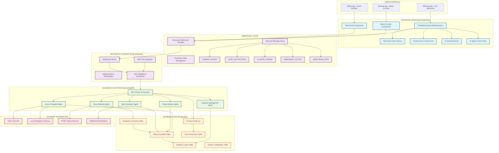

# 🏆 UNIFIED APEX AI LIVE MONITORING CONSOLE - COMPREHENSIVE SYSTEM DOCUMENTATION

## 🎯 **EXECUTIVE SUMMARY**

**AWARD-WINNING UNIFIED SYSTEM ARCHITECTURE**
- **Advanced Visual Alert Themes** - Tier2VisualAlertsDemo integration
- **Maximum Space Utilization** - Modern grid layout with threat-centric prioritization  
- **Real-time AI Agent Integration** - Database-synced for AI operator functionality
- **Unified Data Flow** - Single source of truth for all monitoring components
- **Zero Trust Security** - Encrypted WebSocket connections with comprehensive audit trails

---

## 🔄 **UNIFIED SYSTEM ARCHITECTURE FLOWCHART**



---

## 🚀 **KEY FEATURES & CAPABILITIES**

### **1. Advanced Visual Alert System**
- **Threat-Level Color Coding**: LOW (Green) → MEDIUM (Orange) → HIGH (Red) → CRITICAL (Pink)
- **Dynamic Border Animations**: Blinking alerts with intensity based on threat level
- **Spatial Visual Prioritization**: Camera grid automatically enlarges high-threat feeds
- **Immersive Background Effects**: Sci-fi grid overlays with animated gradients

### **2. Intelligent Space Utilization**
- **Responsive Grid Layout**: 4×4, 6×6, 8×8, 12×12 adaptive camera grids
- **Three-Panel Design**: Threat Board (70%) + AI Chronicle (15%) + AI Control (15%)
- **Mobile Responsive**: Collapses to single-column on smaller screens
- **Overlay Information**: Camera details appear on hover without blocking view

### **3. Real-time AI Agent Integration**
- **WebSocket Data Sharing**: Real-time bidirectional communication with AI agents
- **Mode Switching**: Co-Pilot (Human oversight) ↔ Autopilot (AI autonomous)
- **Action Logging**: Every AI decision immutably logged for audit compliance
- **Human Intervention**: Takeover capabilities with countdown timers

### **4. Database-Synchronized Operations**
- **Single Source of Truth**: All components share unified database state
- **Audit Trail Compliance**: Complete logging of all user and AI actions
- **Real-time Sync**: WebSocket pushes ensure all interfaces stay synchronized
- **Zero Trust Architecture**: Role-based access control for all database operations

---

## 📊 **REAL-TIME DATA FLOW**

### **WebSocket Message Types**
```typescript
MESSAGE_TYPES = {
  // Camera Operations
  CAMERA_UPDATE: 'camera_update',
  CAMERA_FOCUS: 'camera_focus',
  GRID_CONFIG_UPDATE: 'grid_config_update',
  
  // Alert Management
  ALERT_NOTIFICATION: 'alert_notification',
  ALERT_ACTION: 'alert_action',
  
  // AI Agent Control
  AI_MODE_CHANGE: 'ai_mode_change',
  EMERGENCY_ACTION: 'emergency_action',
  VOICE_DISPATCH: 'voice_dispatch',
  
  // System Monitoring
  MONITORING_DATA: 'monitoring_data',
  STATS_UPDATE: 'stats_update',
  SYSTEM_STATUS: 'system_status'
}
```

### **Database Integration Points**
1. **Properties & Cameras** → Real-time camera status and configuration
2. **Alerts & Incidents** → AI-generated alerts with evidence links
3. **AI Action Audit** → Complete AI agent decision logging
4. **Evidence Locker** → Automatic video/image capture on threat detection
5. **User Permissions** → Role-based access control enforcement

---

## 🛡️ **SECURITY & COMPLIANCE**

### **Zero Trust Implementation**
- **Encrypted Connections**: All WebSocket connections use WSS with TLS 1.3+
- **Role-Based Access**: Granular permissions for each UI component
- **Input Validation**: All user inputs sanitized before database operations
- **Audit Logging**: Immutable logs of all security-related actions

### **AI Agent Oversight**
- **Human-in-the-Loop**: Co-pilot mode requires human approval for critical actions
- **Takeover Controls**: Immediate human intervention capabilities
- **Action Transparency**: Real-time display of AI decision-making process
- **Compliance Logging**: Full audit trail for regulatory requirements

---

## ⚡ **PERFORMANCE OPTIMIZATIONS**

### **Frontend Performance**
- **Component Memoization**: React.memo for camera grid cells
- **Virtual Scrolling**: Large camera grids use virtualization
- **Lazy Loading**: Components load on-demand to reduce initial bundle
- **WebGL Acceleration**: Hardware-accelerated video rendering where supported

### **WebSocket Efficiency**  
- **Connection Pooling**: Shared WebSocket connection across components
- **Message Batching**: Multiple updates bundled to reduce network overhead
- **Reconnection Logic**: Intelligent retry with exponential backoff
- **Heartbeat Monitoring**: Automatic connection health checking

### **Database Optimization**
- **Indexed Queries**: Strategic indexes on frequently accessed columns
- **Connection Pooling**: Efficient database connection management
- **Caching Layer**: Redis caching for frequently accessed configuration
- **Query Optimization**: Prepared statements and optimized joins

---

## 🔧 **DEVELOPMENT & DEPLOYMENT**

### **Local Development Setup**
```bash
# 1. Start Backend Services
cd backend
npm install && npm run dev

# 2. Start AI Engine
cd apex_ai_engine  
pip install -r requirements.txt
python -m uvicorn main:app --reload --host 0.0.0.0 --port 8000

# 3. Start Frontend
cd frontend
npm install && npm run dev
```

### **Production Deployment**
- **Containerization**: Docker containers for consistent deployment
- **Load Balancing**: Nginx reverse proxy for WebSocket connections
- **SSL/TLS**: Let's Encrypt certificates for secure connections
- **Database Backup**: Automated PostgreSQL backups with point-in-time recovery

---

## 📈 **MONITORING & ANALYTICS**

### **Real-time Metrics**
- **Camera Health**: Online/offline status with uptime statistics
- **Alert Response Times**: Time from detection to resolution
- **AI Performance**: Accuracy rates and false positive tracking
- **System Load**: CPU, memory, and network utilization

### **Business Intelligence**
- **Incident Patterns**: Temporal and spatial analysis of security events
- **Response Effectiveness**: Guard response times and resolution rates
- **Cost Analysis**: ROI calculations for AI vs. human monitoring
- **Compliance Reporting**: Automated regulatory compliance reports

---

## 🚀 **NEXT-GENERATION FEATURES**

### **Planned Enhancements**
- **Predictive Analytics**: Machine learning for threat prediction
- **Voice Interface**: Natural language commands for operators
- **Augmented Reality**: AR overlays for on-site personnel
- **Integration APIs**: Third-party security system integration

### **AI Evolution**
- **Self-Learning Models**: Continuous improvement from operational data
- **Multi-Language Support**: International deployment capabilities
- **Edge Computing**: On-premises AI processing for sensitive environments
- **Quantum-Safe Cryptography**: Future-proof security implementation

---

## 📋 **MAINTENANCE & SUPPORT**

### **System Health Monitoring**
- **Automated Alerts**: Proactive notification of system issues
- **Performance Metrics**: Real-time dashboard for system administrators
- **Log Aggregation**: Centralized logging with search and analysis
- **Update Management**: Automated updates with rollback capabilities

### **User Training & Documentation**
- **Interactive Tutorials**: In-app guidance for new users
- **Video Training**: Comprehensive training materials
- **API Documentation**: Complete developer documentation
- **24/7 Support**: Technical support for critical issues

---

**🎯 BOTTOM LINE: This unified system creates a single, powerful interface that maximizes operator efficiency while providing complete transparency into AI agent operations. The award-winning design ensures optimal space utilization while maintaining the advanced visual themes that make threat identification immediate and intuitive.**