# 🏗️ **APEX AI UNIFIED SYSTEM ARCHITECTURE FLOWCHART**

## **COMPLETE DATA FLOW & FEATURE INTEGRATION MAP**

```mermaid
graph TB
    %% External Systems
    subgraph "External World"
        Caller[📞 Inbound Caller]
        Police[🚔 Emergency Services]  
        Guards[👮 Security Guards]
        Cameras[📹 Physical Cameras]
        Clients[👤 Property Managers]
    end

    %% User Interfaces Layer
    subgraph "User Interfaces Layer"
        WebConsole[🖥️ Live Monitoring Console<br/>localhost:3000/live-monitoring]
        DesktopApp[💻 Desktop Console<br/>Electron App - Helios]
        ClientPortal[🌐 Client Portal<br/>Aegis Portal]
        MobileApp[📱 Guard Mobile App]
    end

    %% API Gateway & Routing
    subgraph "API Gateway Layer"
        APIGateway[🔐 Node.js API Gateway<br/>Port 5001]
        WebSocketHub[⚡ WebSocket Hub<br/>Real-time Communications]
    end

    %% AI Engine Core
    subgraph "AI Engine Ecosystem"
        MCPServer[🧠 MCP Server<br/>Python FastAPI]
        
        subgraph "AI Agents"
            VoiceAgent[🎤 Voice AI Dispatcher]
            VisionAgent[👁️ Vision Detection Agent]
            DataAgent[📊 Data Management Agent]
            AlertAgent[🚨 Alert Coordination Agent]
            ChatAgent[💬 Conversational AI Agent]
        end
        
        subgraph "AI Models"
            YOLOv8[🎯 YOLOv8 Vision Model]
            LLMLocal[🤖 Local LLM (Ollama)]
            GPT4[🌟 GPT-4 (Fallback)]
        end
    end

    %% Database Layer
    subgraph "Database Layer"
        PostgreSQL[(🗄️ PostgreSQL Database<br/>pgvector + pg_cron)]
        
        subgraph "Database Tables"
            Properties[🏢 Properties]
            Cameras_DB[📹 Cameras]
            Incidents[📋 Incidents] 
            Evidence[📁 Evidence Locker]
            Users[👥 Users & Roles]
            Alerts[🚨 Alerts & Events]
            CallLogs[📞 Call Logs]
            SOP[📝 Standard Operating Procedures]
            AuditLog[📜 Audit Logs]
        end
    end

    %% External Services
    subgraph "External Services"
        Twilio[📞 Twilio Voice API]
        Deepgram[🎧 Deepgram STT]
        ElevenLabs[🗣️ ElevenLabs TTS]
    end

    %% ===================
    %% DATA FLOW CONNECTIONS
    %% ===================

    %% External to UI Layer
    Caller -.-> VoiceAgent
    Police -.-> VoiceAgent
    Guards --> MobileApp
    Cameras --> VisionAgent
    Clients --> ClientPortal

    %% UI Layer to API Gateway
    WebConsole <--> WebSocketHub
    DesktopApp <--> WebSocketHub
    ClientPortal <--> APIGateway
    MobileApp <--> APIGateway

    %% API Gateway to AI Engine
    APIGateway <--> MCPServer
    WebSocketHub <--> MCPServer

    %% AI Agent Interactions
    VoiceAgent <--> Twilio
    VoiceAgent <--> Deepgram  
    VoiceAgent <--> ElevenLabs
    VoiceAgent <--> LLMLocal
    VoiceAgent -.-> GPT4

    VisionAgent <--> YOLOv8
    VisionAgent --> AlertAgent

    ChatAgent <--> LLMLocal
    ChatAgent --> WebSocketHub

    DataAgent <--> PostgreSQL
    AlertAgent --> WebSocketHub

    %% Database Connections
    MCPServer <--> PostgreSQL
    VoiceAgent --> CallLogs
    VisionAgent --> Incidents
    DataAgent --> Evidence
    AlertAgent --> Alerts

    %% Real-time Data Flow Paths
    VisionAgent -->|Threat Detection| WebConsole
    ChatAgent -->|AI Responses| WebConsole
    AlertAgent -->|Live Alerts| WebConsole
    VoiceAgent -->|Call Status| DesktopApp
    DataAgent -->|System Status| WebSocketHub

    %% ===================
    %% STYLING
    %% ===================
    
    classDef primaryUI fill:#00ff88,stroke:#00cc6a,stroke-width:3px,color:#000
    classDef aiEngine fill:#0080ff,stroke:#0066cc,stroke-width:2px,color:#fff
    classDef database fill:#ffaa00,stroke:#cc8800,stroke-width:2px,color:#000
    classDef external fill:#ff6b00,stroke:#cc5500,stroke-width:2px,color:#fff
    classDef dataFlow stroke:#00ff88,stroke-width:2px
    classDef realTime stroke:#ff0040,stroke-width:3px

    class WebConsole,DesktopApp primaryUI
    class MCPServer,VoiceAgent,VisionAgent,DataAgent,AlertAgent,ChatAgent aiEngine
    class PostgreSQL,Properties,Cameras_DB,Incidents,Evidence,Users,Alerts,CallLogs,SOP,AuditLog database
    class Twilio,Deepgram,ElevenLabs external
```

---

## **🔄 UNIFIED DATA SHARING ARCHITECTURE**

### **Real-Time WebSocket Data Flow:**

```mermaid
sequenceDiagram
    participant Console as 🖥️ Live Console
    participant WS as ⚡ WebSocket Hub  
    participant AI as 🧠 AI Agent
    participant DB as 🗄️ Database
    participant Camera as 📹 Vision System

    Camera->>AI: Video Frame Analysis
    AI->>DB: Store Detection Data
    AI->>WS: Threat Alert Event
    WS->>Console: Real-time Alert Update
    Console->>WS: User Action Request
    WS->>AI: Forward User Command
    AI->>DB: Log User Action
    AI->>WS: Action Confirmation
    WS->>Console: Update UI State
    
    Note over Console,DB: All data unified in real-time<br/>AI Agent has complete system awareness
```



---

## **🎯 FEATURE INTEGRATION MAP**

| **Component** | **Database Tables** | **AI Agent Access** | **WebSocket Events** |
|---------------|-------------------|-------------------|---------------------|
| **Live Console** | Cameras, Alerts, Users | ✅ Full Chat Integration | camera_update, new_alert, ai_message |
| **Desktop App** | All Tables | ✅ AI Conversation Panel | call_status, system_status, emergency |
| **Client Portal** | Properties, Incidents, Evidence | ❌ Read-only Reports | incident_update, evidence_sync |
| **Voice AI** | CallLogs, SOP, Contacts | ✅ Autonomous Actions | call_started, dispatch_initiated |
| **Vision AI** | Cameras, Incidents, Evidence | ✅ Threat Detection | detection_result, threat_alert |

---

## **🚀 SYSTEM CAPABILITIES MATRIX**

### **🤖 AI Agent Awareness:**
- **Live Console Chat**: Direct conversation with AI about system status
- **Camera Selection**: AI knows which camera operator is viewing
- **Emergency Actions**: AI logs all human interventions
- **Database Sync**: AI has real-time access to all system data
- **Cross-Platform**: AI agent accessible from Desktop + Web console

### **📊 Database Integration:**
- **Unified Schema**: All applications share same PostgreSQL database
- **Real-time Sync**: Changes propagate instantly across all interfaces
- **Audit Trail**: Every action logged with user/AI attribution
- **Vector Search**: AI embeddings stored for intelligent search

### **⚡ WebSocket Architecture:**
- **Multi-tenant**: Supports multiple simultaneous console operators
- **Event-driven**: All system changes trigger real-time updates
- **Secure**: TLS encryption and authentication required
- **Scalable**: Can handle thousands of concurrent camera streams

---

## **🎮 TESTING YOUR UNIFIED SYSTEM**

### **Step 1: Start the Live Console**
```bash
cd C:\Users\APEX AI\Desktop\defense\frontend
npm start
```

### **Step 2: Navigate to Unified Console**  
Open: `http://localhost:3000/live-monitoring`

### **Step 3: Test AI Agent Integration**
1. **Chat Interface**: Type messages in left panel AI chat
2. **Camera Selection**: Click different cameras - AI should be aware
3. **Emergency Actions**: Test bottom bar emergency controls
4. **System Status**: Verify all connection indicators are green

### **Step 4: Verify Database Integration**
- Check that camera selections update across all connected clients
- Verify alert events appear in real-time
- Test that chat messages persist and sync

### **🎯 Expected Experience:**
- **Maximum Space Utilization**: 3-panel layout uses full screen
- **Visual Alert System**: Cameras pulse/glow based on threat levels  
- **AI Agent Awareness**: Chat responses include system context
- **Real-time Sync**: All changes propagate instantly
- **Award-winning UX**: Smooth animations and professional design

Your unified console should now provide the award-winning, space-optimized experience you envisioned with complete AI agent integration! 🚀